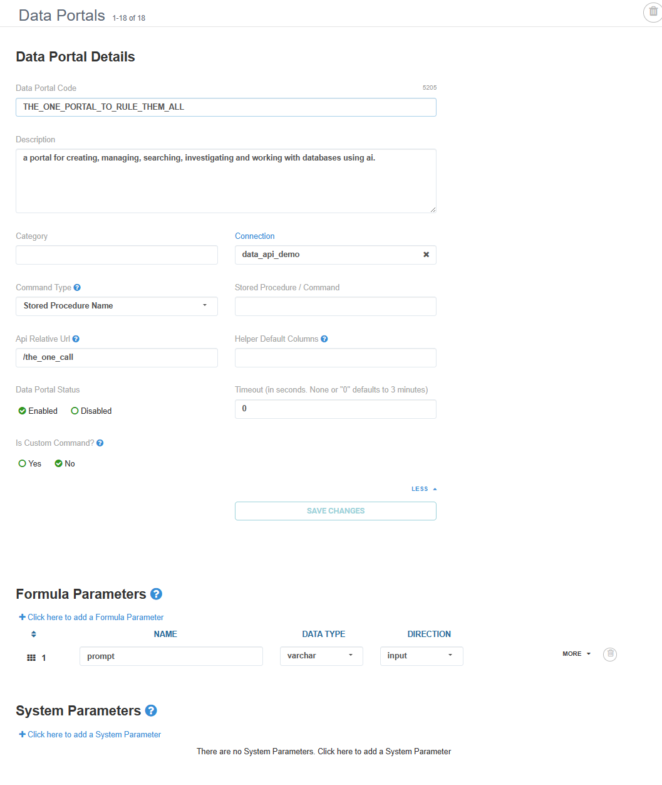
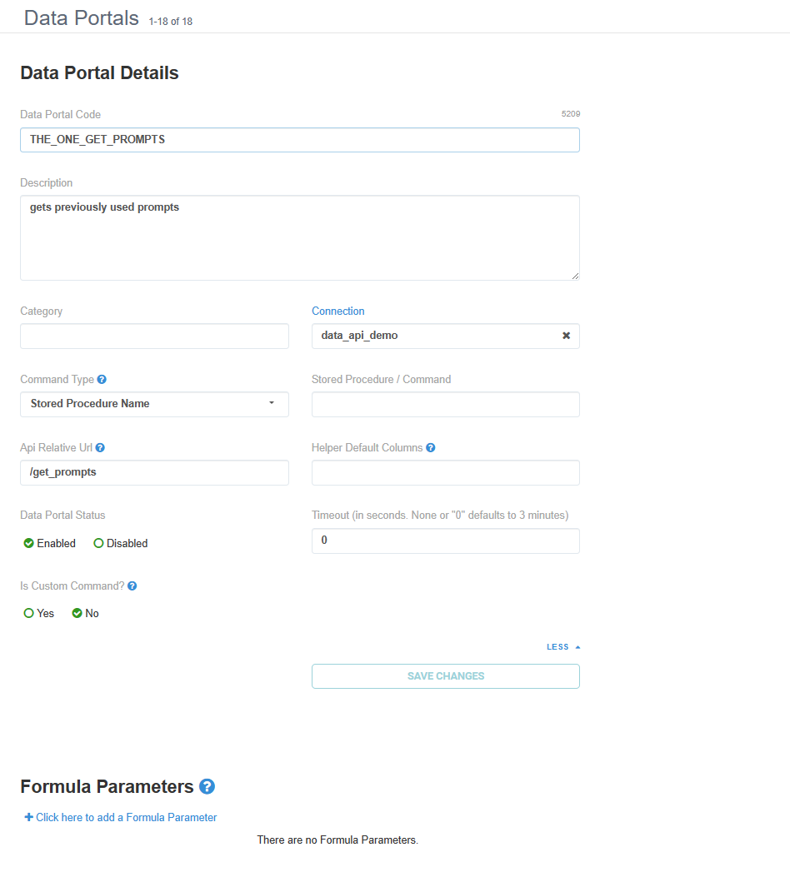

# DuckDB AI Manager Report 
an interject report for creating and interacting with a database using natural language

<br>

# Setup

### Add OpenAI API Key to Env Var
> NOTE: Get your open ai api key ( https://platform.openai.com/api-keys )
```
(windows)
> Set-Item -Path Env:OPENAI_API_KEY -Value ($Env:OPENAI_API_KEY + "sk-???????????????????????????????")
```

<br>

### Install Package
NOTE: you may need to use your own package manager if default python is not >=3.11
```
> cd ids-python-api

> poetry install
```

<br>

### Start Data API
```
python data_api.py
```

> NOTE: if you want to change the ai usage in this package, refer to openai's python package - https://pypi.org/project/openai/

<br>

### Create Interject Data Connection


### Create Interject Data Portals

