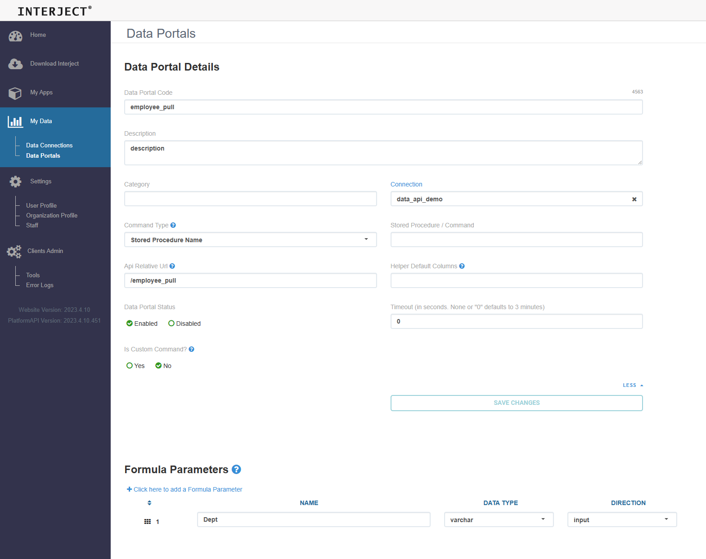

# Interject Python Data API


# Quick Setup

```bash
# install the package
python -m pip install 'idsdata @ git+https://github.com/GoInterject/ids-python-api@master'

# create a config
idsdata create-config

# launch the demo data api
idsdata run
```

<br>
<br>

# Setup Your Data API
Create the python file below, `api.py`

```python
from idsdata import *
import uvicorn
from fastapi import FastAPI

API = FastAPI()

@API.post("/employee_pull", response_model=InterjectResponse)
async def employee_pull(request: InterjectRequest):
    # get data
    table: IDSTable = IDSTable(
        TableName="Table",
        Columns=[
            IDSColumn(ColumnName="Name", Ordinal=1),
            IDSColumn(ColumnName="Start Date", Ordinal=2),
            IDSColumn(ColumnName="Department", Ordinal=3),
            IDSColumn(ColumnName="Salary", Ordinal=4),
        ],
        Rows=[
            ["Mark", "11/25/2021", "Engineering", 60_000],
            ["John", "10/01/2021", "Sales", 72_000],
            ["Amy", "05/12/2020", "Engineering", 83_000],
            ["Loren", "07/25/2019", "Administration", 103_000],
            ["Jeanette", "01/10/2022", "Sales", 65_000],
        ]
    )

    # filter results by interject data portal param
    dept_var: str = request.get_param("Dept").InputValue
    if dept_var != "":
        table = table.filter({"Department":dept_var})

    # create response
    response: InterjectResponse = InterjectResponse(
        RequestParameterList=request.RequestParameterList,
        ReturnedDataList=[
            ReturnedData(data=table).to_dict(),
        ]
    )
    return response

if __name__ == '__main__':
    cfg = Config()
    cfg.load()
    
    uvicorn_config = uvicorn.Config("data_api:API", 
                                    host=cfg.host,
                                    port=cfg.port, 
                                    log_level="info",
                                    reload=cfg.reload
                                    )
    server = uvicorn.Server(uvicorn_config)
    server.run()

```

then run the data api:

```
python api.py
```
<br>

## Run a test with Powershell on the api:

```powershell
(Invoke-WebRequest -method POST -uri "http://127.0.0.1:7777/employee_pull" -body '{"DataPortalName":"Fantom","RequestParameterList":[{"Name": "Dept", "InputValue":"Sales"}]}' -ContentType "application/json").Content
```

<br>

## OR setup a dataportal on interject and run a pull from Excel:

First setup a data connection for your api (on the customer portal https://portal.gointerject.com/)

<br>


<br>

Then setup a data portal



<br>

Then setup a `ReportRange` formula for your data portal in excel and run a pull


